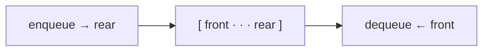

<div align="center">


# Queue Data Structure in C++ — Array Implementation with Enqueue, Dequeue & Menu

<p>
  
  
</p>

</div>

---

A software-engineering coursework exercise: a **FIFO queue** built on a fixed-size array (`MAX_SIZE = 10`) with a console menu to try every operation.

## ⚙️ Operations

| Function | What it does | Complexity |
|---|---|---|
| `init()` | Sets `front = 0`, `rear = -1` | O(1) |
| `enqueue(x)` | Adds `x` at the rear (menu checks `isFull()` first) | O(1) |
| `dequeue()` | Removes and returns the front element (menu checks `isEmpty()` first) | O(1) |
| `size()` | `rear - front + 1` | O(1) |
| `isEmpty()` / `isFull()` | Bounds checks | O(1) |
| `display()` | Prints elements front → rear | O(n) |



## ▶️ Run

```bash
g++ Untitled1.cpp -o queue
./queue
```

```text
1. Enqueue
2. Dequeue
3. Size
4. Display all element
5. Quit
```

## 📚 Concepts

- **FIFO** (first in, first out) ordering
- Front/rear index management in a linear array
- Overflow and underflow checks

> [!NOTE]
> This is a linear (non-circular) queue kept as a learning snapshot: slots freed by `dequeue` aren't reused, and the source is in its original classroom form, so it may need small fixes (explicit return types, the stray line inside `main`) to compile on modern compilers.

---

<div align="center">

**By [Intikhab Azam](https://github.com/intikhab49)** — AI & automation engineer

<sub>Keywords: queue in C++ · array implementation of queue · data structures and algorithms · enqueue dequeue · FIFO · DSA lab</sub>

</div>
